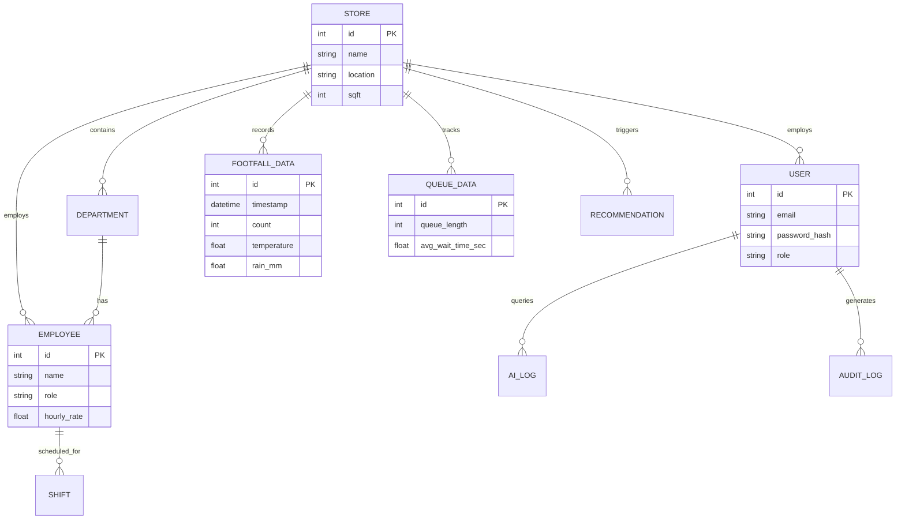
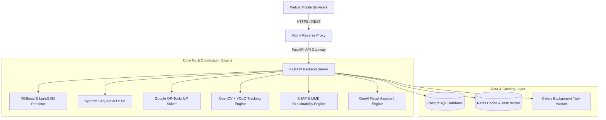
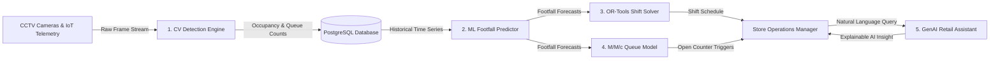
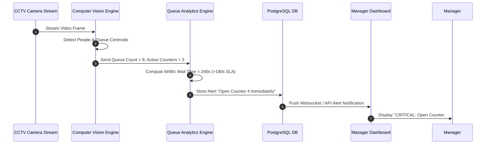

# RetailSense AI - Architectural Diagrams & System Design

This document details the architectural blueprints, database entity relationships, software component hierarchies, and behavioral sequence flows for **RetailSense AI**.

---

## 1. Entity-Relationship Diagram (ERD)

---

## 2. System Architecture Component Diagram

---

## 3. Data Flow Diagram (DFD Level 1)

---

## 4. Sequence Diagram: Real-Time Cashier Open Counter Alert

